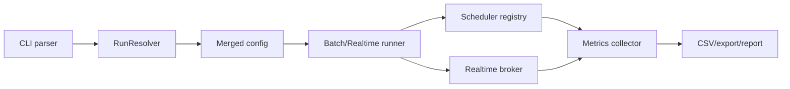

# Architecture

本文档描述主要运行路径和维护边界，便于定位变更影响面。

## Runtime Flow

## Main Packages

| Package | Responsibility |
| :--- | :--- |
| `cli` | 命令解析、配置解析入口、dry-run 输出和运行分发。 |
| `config` | TOML DTO、domain config、validator、loader 和 profile/preset 合并。 |
| `scheduler` | 批处理与实时调度器、算法注册、目标函数和资源候选逻辑。 |
| `broker` | 实时 broker、任务状态、准入、重试、抢占、拓扑和生命周期视图。 |
| `datacenter` | CloudSim 对接、runner、指标聚合、CSV/export、性能趋势和发布结果。 |
| `datacenter.generator` | synthetic 和 Google trace 任务生成。 |
| `util` | 日志、统计和小型工具。 |

## Batch Path

批处理 runner 创建 CloudSim 环境和 cloudlet/vm 列表，然后通过 `AlgorithmRegistry` 解析 batch scheduler。调度器返回 VM 下标分配，指标计算统一使用 `vm.id -> vmList index` 映射，避免把 VM id 当作数组下标。

目标函数在初始化阶段缓存 cloudlet length、VM MIPS、成本和归一化边界；单 VM、同质 VM 或空分母场景返回有限 fitness。

## Realtime Path

实时 runner 使用 realtime scheduler 与 `RealtimeBroker`。Broker 外观保留 CloudSim 事件入口，内部服务处理：

- 到达和提交。
- 候选 VM 选择与准入拒绝。
- runtime failure、timeout、preemption 和 autoscaling。
- active VM accounting、tenant/topology metrics 和 read views。

实时 PSO/WOA 只在 accepted candidates 上优化，最终结果会映射回真实 VM 下标并再次校验。

## Metrics

实时指标由 `RealtimeMetricSchema` facade 暴露。内部 catalog 固定指标顺序，projection 负责 trial/summary header、空值和有序 map。`docs/realtime-metrics.md` 由同一 schema 生成，测试会锁定文档和 CSV 表头。

## CloudSim Plus Source Build

CloudSim Plus 不从 Maven Central 静默解析。默认构建流程：

1. `verifyLockedCloudSimPlusSource` 验证 submodule checkout、gitlink、POM version 和 `gradle/cloudsimplus.lock`。
2. `buildCloudSimPlusFromSource` 使用 Maven 构建源码并 stage 锁定版本 JAR/POM。
3. `sanitizeCloudSimPlusJarManifest` 去除会破坏 Gradle cache 的 manifest `Class-Path`。
4. Gradle 只从 sanitized local repository 解析 `org.cloudsimplus:cloudsimplus`。

显式 `-Pcloudsimplus.ref=...` 或 `-Pcloudsimplus.autoUpdate=true` 才进入可变 fetch/checkout 路径。

## Output And Release Flow

运行结果写入 `runs/`。Release package 包含 fatJar、脚本、配置、数据、日志配置、SBOM、许可证报告和 manifest。容器构建使用 `build/container-context`，该目录只包含运行镜像需要的最小文件集。
